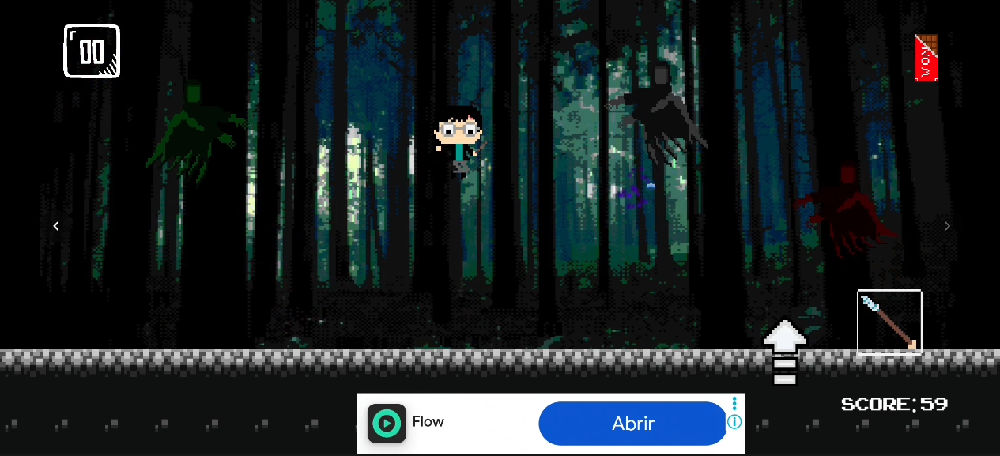
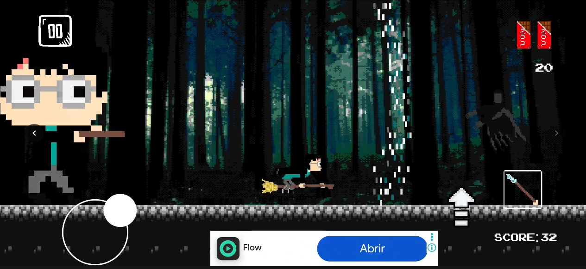

# Harry's Nightmares 🌙

> A casual shoot'em up for Android — dodge your enemies, survive the waves, and beat your friends' high score.

  

  

---

**Harry's Nightmares** is a casual shoot'em up I developed and published on the Google Play Store at 17, and have maintained ever since. As a Systems Engineering student at UTN FRBA, I later took the original monolithic codebase through a full refactoring — turning it into a decoupled, data-driven and performance-conscious architecture without breaking a single live feature.

The result is a project that covers the whole lifecycle: designing the mechanics, shipping the build, monetizing it, and then going back to engineer it properly.

## 📸 Screenshots

| Gameplay | Power-ups |
|:---:|:---:|
|  |  |

## 🚀 The Journey

* **Original release.** Built and shipped solo: core mechanics, touch input, scoring, scene flow.
* **Live operation.** AAB signing, content rating, data safety declarations and successive updates through Google Play Console.
* **Engineering phase.** Deep refactoring focused on decoupled architecture, memory optimization and clean code standards.

## 🛠️ Tech Stack

* **Engine:** Unity 2020.3.49 LTS
* **Language:** C# — advanced OOP, data structures
* **Monetization:** Google AdMob (ad unit configuration and in-game integration)
* **Distribution:** Google Play Console — AAB build and signing, release management
* **Tools:** Git

## 📈 Refactoring Highlights

### 🏗️ Architecture & Design Patterns

* **Event-driven UI (Observer pattern).** Total decoupling between game logic and UI using C# Actions. The `UIManager` reacts to score, lives and state changes emitted by the `GameManager` instead of polling it.
* **Finite State Machine.** A robust FSM manages global game flow (Menu, Playing, Paused, GameOver) and complex player states, replacing nested conditionals with scalable state-based logic.
* **Data-driven design.** `ScriptableObject`s externalize player statistics, difficulty curves and wave definitions, allowing game balancing without recompiling.

### ⚡ Performance Optimization

* **Custom object pooling.** A pooling system for projectiles and visual effects minimizes `Instantiate`/`Destroy` calls, significantly reducing Garbage Collector pressure.
* **Physics layer matrix.** Collision detection migrated from manual tag checks in `Update` to native layer-based filtering, delegating interaction logic to Unity's low-level physics engine.
* **Incremental registry cleanup.** A stepwise cleanup algorithm for entity registries prevents memory leaks and keeps FPS stable during high-density enemy waves.

### 🛡️ Robustness & Clean Code

* **Animator hashing.** Animation IDs pre-calculated via `Animator.StringToHash`, avoiding expensive per-frame string lookups.
* **Centralized constants.** A `GameConstants` static class manages every tag, layer and audio identifier, eliminating magic strings and enforcing type safety.
* **Inheritance & abstraction.** Power-up and entity logic refactored around base classes and `virtual`/`override` methods to enforce DRY.

---

Developed by **Ignacio Agustín Pereda Hernandez** · Systems Engineering student @ UTN FRBA
[LinkedIn](https://www.linkedin.com/in/ignacio-agustin-pereda-hernandez/) · [GitHub](https://github.com/ignacioperedah)
